# 🤖 CortexOS

A modular, evidence-based **AI Developer Brain & Agentic Coding Workflow System** designed for AI coding assistants. Built on top of a shared **Project Memory** foundation, **CortexOS** provides 30 standardized slash-command workflows organized across 6 core skill groups.

---

## 📥 Installation & Quick Start

To use **CortexOS** in any of your projects, all you need is the `.agents/` directory in your project root!

### Option 1: One-Line Installer (Recommended)

**Windows (PowerShell):**
```powershell
git clone --depth=1 https://github.com/alimohamedcv2025-code/-CortexOS.git temp-cortex; Move-Item temp-cortex/.agents .; Remove-Item -Recurse -Force temp-cortex
```

**Linux / macOS (Bash):**
```bash
git clone --depth=1 https://github.com/alimohamedcv2025-code/-CortexOS.git temp-cortex && mv temp-cortex/.agents . && rm -rf temp-cortex
```

### Option 2: Manual Installation
1. Clone or download this repository.
2. Copy the `.agents/` folder directly into the root of your target project.
3. Run `/init` in your AI coding assistant to bootstrap the `.agent/memory/` persistent memory space.

---

## Architecture Overview

```
.
├── .agent/
│   └── memory/                  # Shared Runtime Project Memory (Cortex)
│       ├── config.yml            # Auto-write behavior & skill permissions
│       ├── overview.md           # High-level overview & tech stack
│       ├── architecture.md       # System topology, components & data flow
│       ├── conventions.md        # Coding standards & styling rules
│       ├── decisions.md          # Architectural Decision Records (ADRs)
│       ├── features.md           # Implemented & backlog features
│       ├── issues.md             # Active bugs & technical debt
│       └── history.md            # Release log & version history
│
└── .agents/
    ├── skills/                  # Skill Definitions (SKILL.md)
    │   ├── project-management/   # Project initialization & audits
    │   ├── development/          # Core coding workflows (feature, fix, refactor, etc.)
    │   ├── code-review/          # Static analysis (security, perf, arch)
    │   ├── testing/              # Test generation, execution & fixing
    │   ├── git-operations/       # Git porcelain & plumbing wrappers
    │   └── project-memory/       # Memory CRUD, refresh & export operations
    │
    └── workflows/               # Thin slash-command wrappers (30 workflows)
```

### System Flow & Architecture Diagram

```mermaid
graph TD
    classDef workflowStyle fill:#2b3a42,stroke:#4fb3bf,stroke-width:2px,color:#fff;
    classDef skillStyle fill:#1e293b,stroke:#0EA5E9,stroke-width:2px,color:#fff;
    classDef memoryStyle fill:#14532d,stroke:#22c55e,stroke-width:2px,color:#fff;
    classDef codeStyle fill:#4c1d95,stroke:#a855f7,stroke-width:2px,color:#fff;

    subgraph WORKFLOWS ["⚡ Workflows (/commands)"]
        W_PM["/init"]:::workflowStyle
        
        subgraph DEV_WF ["Development Workflows"]
            W_DEV1["/feature"]:::workflowStyle
            W_DEV2["/fix"]:::workflowStyle
            W_DEV3["/debug"]:::workflowStyle
            W_DEV4["/modify"]:::workflowStyle
            W_DEV5["/refactor"]:::workflowStyle
            W_DEV6["/remove"]:::workflowStyle
        end

        subgraph MEM_WF ["Memory Workflows"]
            W_MEM1["/memory & /memory-init"]:::workflowStyle
            W_MEM2["/memory-update & /memory-refresh"]:::workflowStyle
            W_MEM3["/memory-search & /memory-forget"]:::workflowStyle
            W_MEM4["/memory-export"]:::workflowStyle
        end

        subgraph REV_WF ["Review Workflows"]
            W_REV1["/review & /review-architecture"]:::workflowStyle
            W_REV2["/review-security & /review-performance"]:::workflowStyle
        end

        subgraph TEST_WF ["Testing Workflows"]
            W_TEST1["/test & /test-unit"]:::workflowStyle
            W_TEST2["/test-integration & /test-e2e & /test-fix"]:::workflowStyle
        end

        subgraph GIT_WF ["Git Operations Workflows"]
            W_GIT1["/git-status & /git-diff & /git-log"]:::workflowStyle
            W_GIT2["/git-commit & /git-branch & /git-sync & /git-undo"]:::workflowStyle
        end
    end

    subgraph SKILLS ["🧠 Core Skills (.agents/skills/)"]
        S_PM["project-management"]:::skillStyle
        S_DEV["development"]:::skillStyle
        S_MEM["project-memory"]:::skillStyle
        S_REV["code-review"]:::skillStyle
        S_TEST["testing"]:::skillStyle
        S_GIT["git-operations"]:::skillStyle
    end

    subgraph MEMORY ["💾 Agent Memory (.agent/memory/)"]
        M_CFG["config.yml"]:::memoryStyle
        M_OVR["overview.md"]:::memoryStyle
        M_ARC["architecture.md"]:::memoryStyle
        M_CNV["conventions.md"]:::memoryStyle
        M_DEC["decisions.md"]:::memoryStyle
        M_FTR["features.md"]:::memoryStyle
        M_ISS["issues.md"]:::memoryStyle
        M_HST["history.md"]:::memoryStyle
    end

    subgraph CODEBASE ["💻 Codebase & Repository"]
        CODE_FILES["Project Source Code & Files"]:::codeStyle
    end

    %% Workflow to Skill Connections
    W_PM --> S_PM
    DEV_WF --> S_DEV
    MEM_WF --> S_MEM
    REV_WF --> S_REV
    TEST_WF --> S_TEST
    GIT_WF --> S_GIT

    %% Skills interactions with Memory
    S_PM -- "Scan & Audit Stack" --> M_OVR
    S_PM -- "Bootstrap Config" --> M_CFG
    
    S_DEV -- "Read Rules/Architecture" --> M_CNV
    S_DEV -- "Read Rules/Architecture" --> M_ARC
    S_DEV -- "Auto-update Features/Issues" --> M_FTR
    S_DEV -- "Auto-update Features/Issues" --> M_ISS
    S_DEV -- "Log History" --> M_HST

    S_MEM -- "Manages & Reconciles" --> MEMORY

    S_REV -- "Read Specs & Patterns" --> M_ARC
    S_REV -- "Read Specs & Patterns" --> M_CNV
    S_REV -- "Read Specs & Patterns" --> M_DEC

    S_TEST -- "Check Test Patterns" --> M_CNV
    S_TEST -- "Log Fixed Issues" --> M_ISS

    S_GIT -- "Log Commits/Releases" --> M_HST

    %% Skills interactions with Codebase
    S_PM --> CODE_FILES
    S_DEV --> CODE_FILES
    S_REV --> CODE_FILES
    S_TEST --> CODE_FILES
    S_GIT --> CODE_FILES
```



---

## The 6 Core Skill Groups

### 1. Project Management (`project-management`)
Handles project-level setup, tech stack detection, structure audits, and memory bootstrapping.
- **Location**: [.agents/skills/project-management/SKILL.md](.agents/skills/project-management/SKILL.md)

### 2. Development (`development`)
Drives all core coding tasks: planning, implementation, bug fixing, structured debugging, refactoring, and safe removals.
- **Location**: [.agents/skills/development/SKILL.md](.agents/skills/development/SKILL.md)

### 3. Code Review (`code-review`)
Provides read-only static analysis and structured reviews against conventions and architectural ADRs.
- **Location**: [.agents/skills/code-review/SKILL.md](.agents/skills/code-review/SKILL.md)

### 4. Testing (`testing`)
Manages test creation, execution, and test failure diagnosis across unit, integration, and e2e levels.
- **Location**: [.agents/skills/testing/SKILL.md](.agents/skills/testing/SKILL.md)

### 5. Git Operations (`git-operations`)
Provides safe Git wrappers with conventional commit formatting, branch management, diffs, and undo safety checks.
- **Location**: [.agents/skills/git-operations/SKILL.md](.agents/skills/git-operations/SKILL.md)

### 6. Project Memory (`project-memory`)
Serves as the shared persistent memory engine tracking architecture, features, issues, conventions, and history.
- **Location**: [.agents/skills/project-memory/SKILL.md](.agents/skills/project-memory/SKILL.md)

---

## Slash Command Reference (30 Workflows)

| Skill Group | Command | Workflow File | Description | Memory Write |
|---|---|---|---|:---:|
| **Project Management** | `/init` | [init.md](.agents/workflows/init.md) | Audit structure, detect tech stack, bootstrap memory | ✅ Yes |
| **Development** | `/feature` | [feature.md](.agents/workflows/feature.md) | Plan & implement a new feature following conventions | ✅ Yes |
| | `/fix` | [fix.md](.agents/workflows/fix.md) | Diagnose and fix a bug with root-cause analysis | ✅ Yes |
| | `/debug` | [debug.md](.agents/workflows/debug.md) | Investigate issues (reproduce, isolate, report) | ⚠️ Conditional |
| | `/refactor` | [refactor.md](.agents/workflows/refactor.md) | Restructure code preserving external behavior | ✅ Yes |
| | `/modify` | [modify.md](.agents/workflows/modify.md) | Make targeted code modification with minimal scope | ⚠️ Conditional |
| | `/remove` | [remove.md](.agents/workflows/remove.md) | Safely remove code/features with dependency check | ✅ Yes |
| **Code Review** | `/review` | [review.md](.agents/workflows/review.md) | Review quality, readability, and correctness | ❌ Read-only |
| | `/review-security` | [review-security.md](.agents/workflows/review-security.md) | Security review (XSS, injection, auth, secrets) | ❌ Read-only |
| | `/review-performance` | [review-performance.md](.agents/workflows/review-performance.md) | Performance review (bottlenecks, memory, complexity) | ❌ Read-only |
| | `/review-architecture` | [review-architecture.md](.agents/workflows/review-architecture.md) | Architecture review (SOLID, coupling, patterns) | ❌ Read-only |
| **Testing** | `/test` | [test.md](.agents/workflows/test.md) | Run full test suite and report results | ❌ Read-only |
| | `/test-unit` | [test-unit.md](.agents/workflows/test-unit.md) | Create or run unit tests | ⚠️ Conditional |
| | `/test-integration` | [test-integration.md](.agents/workflows/test-integration.md) | Create or run integration tests | ⚠️ Conditional |
| | `/test-e2e` | [test-e2e.md](.agents/workflows/test-e2e.md) | Create or run end-to-end user flow tests | ⚠️ Conditional |
| | `/test-fix` | [test-fix.md](.agents/workflows/test-fix.md) | Diagnose and fix failing tests | ✅ Yes |
| **Git Operations** | `/git-status` | [git-status.md](.agents/workflows/git-status.md) | Show working tree status & staged changes | ❌ Read-only |
| | `/git-diff` | [git-diff.md](.agents/workflows/git-diff.md) | Show diffs (working, staged, or between refs) | ❌ Read-only |
| | `/git-commit` | [git-commit.md](.agents/workflows/git-commit.md) | Stage & commit with conventional message | ✅ Yes |
| | `/git-branch` | [git-branch.md](.agents/workflows/git-branch.md) | Create, switch, list, or delete branches | ❌ Read-only |
| | `/git-log` | [git-log.md](.agents/workflows/git-log.md) | Show recent commit history graph | ❌ Read-only |
| | `/git-undo` | [git-undo.md](.agents/workflows/git-undo.md) | Soft/hard reset, unstage, or discard changes | ⚠️ Conditional |
| | `/git-sync` | [git-sync.md](.agents/workflows/git-sync.md) | Pull/push with conflict detection | ❌ Read-only |
| **Project Memory** | `/memory` | [memory.md](.agents/workflows/memory.md) | Show current memory summary | ❌ Read-only |
| | `/memory-init` | [memory-init.md](.agents/workflows/memory-init.md) | Initialize memory by scanning codebase | ✅ Yes |
| | `/memory-update` | [memory-update.md](.agents/workflows/memory-update.md) | Targeted update to memory categories | ✅ Yes |
| | `/memory-refresh` | [memory-refresh.md](.agents/workflows/memory-refresh.md) | Re-scan codebase and reconcile memory | ✅ Yes |
| | `/memory-search` | [memory-search.md](.agents/workflows/memory-search.md) | Keyword search across memory documents | ❌ Read-only |
| | `/memory-forget` | [memory-forget.md](.agents/workflows/memory-forget.md) | Soft-delete/archive an entry from memory | ✅ Yes |
| | `/memory-export` | [memory-export.md](.agents/workflows/memory-export.md) | Export memory as consolidated markdown/folder | ❌ Read-only |

---

## Recommended Playbooks (Optimal Command Workflows)

### 1. Building a New Project from Scratch (`Greenfield / Bootstrap`)
When bootstrapping a brand-new application, follow this sequence:
1. **`/init`**: Scans the project directory, detects the tech stack/framework, audits required configuration files, and bootstraps `.agent/memory/`.
2. **`/memory-update`**: Define initial project conventions, target architecture patterns, and key ADRs before writing code.
3. **`/feature`**: Build the initial MVP features. This automatically populates `features.md`, `architecture.md`, and `history.md`.
4. **`/test-unit`**: Author unit tests for the core logic modules.
5. **`/git-commit`**: Create the initial commit (`feat(init): bootstrap project structure and core features`).

---

### 2. Adding a New Feature (`New Feature Flow`)
When implementing a new feature in an existing codebase:
1. **`/memory-search`**: Search existing memory files for related conventions, architectural patterns, and dependencies.
2. **`/feature`**: Execute feature planning and implementation. Automatically updates `features.md`, `architecture.md`, and `history.md`.
3. **`/test-unit``** / **`/test-integration`**: Write test cases covering happy paths, edge cases, and integration boundaries.
4. **`/review`**: Run static code review against `conventions.md` to ensure high quality and zero regressions.
5. **`/git-commit`**: Stage and commit changes with a conventional commit message (`feat(scope): add new feature`).

---

### 3. Fixing a Bug (`Bug Fix & Debugging Flow`)
When investigating and resolving an issue:
1. **`/debug`**: Reproduce, isolate, and identify the root cause step-by-step without making premature code modifications.
2. **`/fix`**: Apply the minimal, targeted bug fix. Automatically marks the issue resolved in `issues.md` and records it in `history.md`.
3. **`/test-fix`**: Verify that the failing test now passes or write a regression test to prevent recurrence.
4. **`/git-commit`**: Commit the fix (`fix(scope): resolve issue description`).

---

### 4. Code Review Flow (`Quality & Audit Flow`)
For structured code quality, security, and performance audits:
1. **`/review-security`**: Perform an OWASP security audit (check for XSS, SQLi, unsanitized inputs, hardcoded secrets).
2. **`/review-performance`**: Check for performance bottlenecks, memory leaks, algorithmic complexity ($O(n^2)$), and rendering issues.
3. **`/review-architecture`**: Evaluate coupling, SOLID principles, separation of concerns, and compliance with ADRs in `decisions.md`.
4. **`/review`**: Run a general readability, formatting, and edge-case review.

---

### 5. Testing Strategy (`Testing Flow`)
When authoring or verifying tests across the codebase:
1. **`/test-unit`**: Create and run isolated unit tests for individual functions and helper modules.
2. **`/test-integration`**: Create and run integration tests across component boundaries and data layers.
3. **`/test-e2e`**: Create and run end-to-end user flow tests for critical user journeys.
4. **`/test`**: Run the complete test suite and review pass/fail statistics and coverage.
5. **`/test-fix`**: Automatically diagnose and resolve any failing tests.

---

### 6. Git Operations & Version Control (`Git Flow`)
For safe, structured Git branch management and commits:
1. **`/git-status`** & **`/git-diff`**: Review unstaged/staged changes and inspect exact diffs.
2. **`/git-branch`**: Create and switch to feature or bugfix branches (`git checkout -b feat/...`).
3. **`/git-commit`**: Stage files and generate formatted conventional commit messages (`feat(...)`, `fix(...)`, `refactor(...)`).
4. **`/git-sync`**: Safely sync with remote upstream repository (`git pull --rebase` and `git push`).
5. **`/git-undo`**: Roll back commits or unstage files safely with user confirmation prompts.

---

## Memory Protection & Guard Rules

Every skill checks permissions defined in `.agent/memory/config.yml` before modifying any memory file:

```yaml
auto_write:
  enabled: true
  allow_external_skills: true
  
  categories:
    overview.md: true
    architecture.md: true
    conventions.md: true
    decisions.md: true
    features.md: true
    issues.md: true
    history.md: true

  skills:
    project-memory: true
    project-management: true
    development: true
    code-review: false      # Read-only skill
    testing: true
    git-operations: true
```

### Guard Verification Steps:
1. Verify `auto_write.enabled == true`
2. Verify `auto_write.allow_external_skills == true` (for external skills)
3. Verify `auto_write.skills.<skill_name> != false`
4. Verify `auto_write.categories.<filename> == true`
5. If any check fails, skip auto-write and prompt the user to use `/memory-update`.

---

## Core Execution Rules

1. **Never Invent Facts**: Report and document only verified facts from source files.
2. **Read Memory First**: Always check `.agent/memory/` for conventions and architecture before coding.
3. **Thin Workflows**: Keep slash workflows thin and delegate implementation logic to `SKILL.md`.
4. **Archive on Contradiction**: Move outdated or superseded features/rules to archive sections rather than hard deleting.
5. **Cross-Platform Naming**: Workflow filenames use hyphenated names (`git-status.md`) for Windows file system compatibility.
